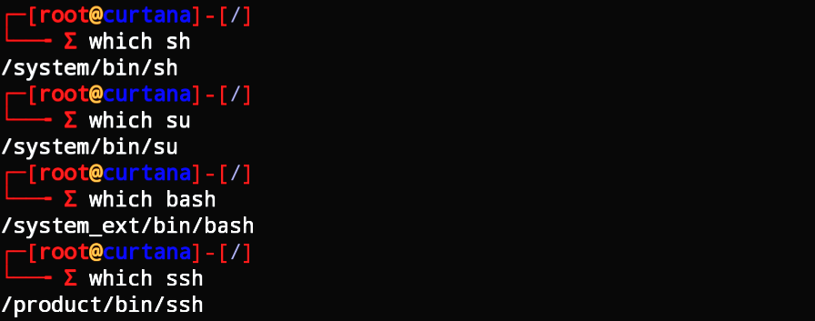

  

# 🦜 Cool Terminal

  
  
   
  
  

 

**Cool Terminal** is a universally compatible system optimization module engineered to replace Android's stock, generic `mkshrc` shell configuration with a vibrant **ParrotOS Style** command prompt. Operating via high-performance systemless overlays, it injects advanced CLI configurations and expands default execution parameters seamlessly across both root and non-root environments.

---

## 📑 Table of Contents
- [📊 Analytics](#-analytics)
- [🧪 Key Features & Optimizations](#-key-features--optimizations)
- [📦 Environment Compatibility](#-environment-compatibility)
- [🛠️ Installation Instructions](#️-installation-instructions)
- [🤝 Contributing & License](#-contributing--license)

---

## 📊 Analytics

 

 
 
> 🧩 Grab the latest automated `v1.0.0` build zip directly from our [Releases Page](https://github.com/One4Lots/Cool_Terminal/releases/tag/v1.0.0).

 

---

## 🧪 Key Features & Optimizations

* **ParrotOS Shell Aesthetics:** Replaces the flat system shell terminal environment with a professional hacker-style visual environment inspired directly by Parrot Security OS.
* **Dual Privilege Profiles:** Intelligently alters runtime styles and accent colors automatically depending on standard session vs. superuser `root` states.
* **Smart PATH Injection:** Safely appends `/system_ext/bin` and `/product/bin` into the active terminal `$PATH` environment variable, making system binaries instantly discoverable.
* **Systemless Filesystem Overlay:** Seamlessly compatible across old and modern root methodologies. Zero persistent background daemons, running with native system speed and minimal memory footings.

---

## 📦 Environment Compatibility

This utility layout script is fully optimized and structurally tested across the following environments:

| System Layer | Target Specifications |
| :--- | :--- |
| **Root Solutions** | KernelSU (Official), KernelSU-Next, Magisk v24.0+, APatch |
| **Shell Engine** | Android Native MirBSD Korn Shell (`mksh`) |
| **Interface Emulators** | Termux, Local ADB shell instances, Terminal Emulator for Android |

---

## 🛠️ Installation Instructions

1. **Download:** Navigate over to the [Releases Section](https://github.com/One4Lots/Cool_Terminal/releases) and fetch the compiled `cool_terminal.zip` module archive.
2. **Flash:** 
   * **For KernelSU / KSU-Next:** Open your manager application, go to the MODULE repository, tap **Install**, it will install the module.
   * **For Magisk / APatch:** Open Magisk App, access the **Modules** section on the bottom right panel, select **Install from storage**, and confirm choice.
3. **Reboot:** Power cycle your Android device to activate the virtual mounting systems.
4. **Launch:** Run your preferred environment shell (e.g., Termux), declare `su`, and welcome your custom terminal layout!

---

## 🤝 Contributing & License

Feel free to open feature requests, issue tickets, or style optimization pull requests inside our tracker layout. This terminal project is maintained and distributed openly under the **MIT License**.

 

  <i>Optimized with ❤️ for the Android Development & Customization Community.</i>

